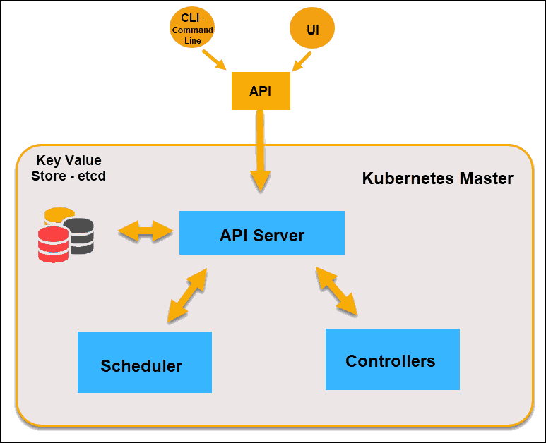
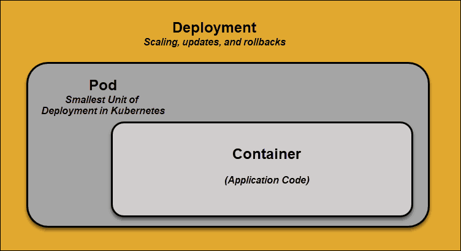

# kyb
Kybernetes Home office

## Dag 19.3.20 8:30 - 16:30

- [x] Setup work enviroment
    - [x] Install VurtualBox guest additions
    - [x] Install Centos8 on virtualBox
    - [x] Install TMUX
    - [x] Install minoconda
    - [x] Install Minikube (single-node Kubernetes) <https://kubernetes.io/docs/tasks/tools/install-kubectl/>
        - [x] None-empty `grep -E --color 'vmx|svm' /proc/cpuinfo` 
            - [x] Enable Nested VT-x/AMD-V VB manager
    - [x] Install Kubernetes <https://phoenixnap.com/kb/how-to-install-kubernetes-on-centos>
        - [x] Install kubectl
    - [x] Setup SSH key on github
    - [x] Setup postman  <https://tutorialforlinux.com/2019/09/26/how-to-install-postman-on-centos-8-easy-guide/2/>
    - [x] Fix not enough space on root disk (16 G too small!)
        - [x] Install gparted `sudo dnf install gparted`
        - [x] Extend partition in VirtualBox
        - [x] Extend partiton table with 16.23 GiB more
            - [x] `lvextend -L +16.23GiB /dev/mapper/cl-root`
            - [x] `partprobe`
            - [x] `xfs_growfs /`
- [x] Setup conda enviroment "kubec"  
`conta create -n kubec python=3.6 pip`  
`source activate kubec`  
`source deactivate`  
    - [x] Install Python v3.6
    - [x] Install Flask
    - [x] Install pymongo
    - [x] Install redis
    - [x] Install python-dateutil: <https://pypi.org/project/python-dateutil/>
    - [-] Install Hamcrest
- [x] Install Vscode
    - [x] Python extension
    - [x] Yaml extension
    
- [x] Follow Tutorial to learn basics of Kubernetes

## Dag 20.3.20 kl 9:30

- [x] Kubernetes architecture overview: <https://www.youtube.com/watch?v=8C_SCDbUJTg>
- [x] Follow Basic Tutorial: <https://api.mongodb.com/python/current/tutorial.html>
- [x] Setup Mongodb client
    - [x] Install mongodb: <https://docs.mongodb.com/manual/tutorial/install-mongodb-on-red-hat/>
```repo
cat >/etc/yum.repos.d/mongodb-org-4.2.repo <<EOL
[mongodb-org-4.2]
name=MongoDB Repository
baseurl=https://repo.mongodb.org/yum/redhat/$releasever/mongodb-org/4.2/x86_64/
gpgcheck=1
enabled=1
gpgkey=https://www.mongodb.org/static/pgp/server-4.2.asc
EOL
```
- [x] Aggregate in Mongodb: <https://medium.com/@paulrohan/aggregation-in-mongodb-8195c8624337>
- [x] Aggregation Mongod: <https://docs.mongodb.com/manual/aggregation/>

## Dag 23.3.20 kl 9:00 - 17:45
- [x] Aggregate in Mongodb: <https://medium.com/@paulrohan/aggregation-in-mongodb-8195c8624337>
- [x] Mongo Aggregations in 5 Minutes: <https://engineering.universe.com/mongo-aggregations-in-5-minutes-b8e1d9c274bb>
- [x] Chanter 4: Quering: <https://www.oreilly.com/library/view/mongodb-the-definitive/9781449344795/ch04.html>

## Dag 24.3.20 kl 9:15
- [?] Installing Podman-docker <https://thenewstack.io/check-out-podman-red-hats-daemon-less-docker-alternative/>
    `sudo dnf install @container-tools` 
- [x] Install podman <https://podman.io/getting-started/installation>
- [x] Basic Setup and Use of podman <https://podman.io/getting-started/>
```cmd
podman run -dt -p 8080:8080/tcp -e HTTPD_VAR_RUN=/var/run/httpd -e HTTPD_MAIN_CONF_D_PATH=/etc/httpd/conf.d \
                  -e HTTPD_MAIN_CONF_PATH=/etc/httpd/conf \
                  -e HTTPD_CONTAINER_SCRIPTS_PATH=/usr/share/container-scripts/httpd/ \
                  registry.fedoraproject.org/f29/httpd /usr/bin/run-httpd
```

- [] Snapshot of current build
- [] Git push changes before shutdown.


### Backlog
- [ ] Setup kubernetes cluster
- [ ] Setup feature flags on kubernetes
- [ ] Setup feature flags on flask  
- [ ] Setup Flask Backend
- [ ] Setup Flask Frontend
- [ ] Setup Redis with mongodb
- [ ] Connect Backend with Frontend
- [ ] Setup keycloak

## Podman
`podman pull images`: First check registry.redhat.io for latest image, then docker.io if not there.
`podman images`: List images availible.
`podman rmi ID`: Delete images on ID tag
`podman rm ID`: Delete container _'-f'_ to force already running containers.
`podman inspect ID`:  Inspect '-l' latest running or ID container for metadata.
`podman logs ID`: View container's logs.
`podman top ID`: View container's top statuses (CPU %, PID etc)
`sudo podman container checkpoint ID`: Stop and store state of a container for later use.
`sudo podman container restore ID`: Restore container at the exact same state as checkpoint.

## mongodb queries
`db.collection.find({query})`:  
`db.collection.insert_one({})`:  Insert one document into collection.
`db.collection.insert_many([{}])`: Insert multiple documents at once. (Not one after the other).  
`db.collection.create_index([('user_id', pymongo.ASCENDING)],unique=True)`:  Unique index per document.

__Operators__ come in three varities: __stages__,__expressions__, and __accumulators__. 
### Aggregastion
A Pipeline.


#### Minikube
`minikube start` : Start cluster  
`minikube dashboard` : Access the Kubernetes Dashboard running within the minikube cluster.  
`minikube stop` : Stop local cluster  
`minikube delete` : Delete local cluster  
`minikube delete --all` : Delete all local clusters and profiles  

Once started: `kubectl`  
`kubectl create deployment hello-minikube --image=k8s.gcr.io/echoserver:1.4` : Start server.  
`kubectl expose deployment hello-minikube --type=NodePort --port=8080` : Exposing a service as a NodePort.  
`minikube service hello-minikube` : Open exposed endpoin in your browser.  
`minikube start -p cluster2` : Start second local cluster (only with bare-metal/none driver).  

`minikube config set memory x` : increase memory beyond just default 2 GB.

#### Kubectl - Kubernetes command-line tool.
Allows to run commands against Kubernetes clusters.
`kubectl cluster-info` : Details of the cluster and its health status
`kubectl get po(ds) -A` : See all pod state
`kubectl get nodes` : view the nodes in the cluster
`kubectl get pv` : Get persistent volume

`kubectl drain <nodename>` : evict all user pods from the node
`kubectl delete node <nodename>` : delete node from cluster

## Kubernetes Architecture
<https://phoenixnap.com/kb/understanding-kubernetes-architecture-diagrams>


### Steps in a basic Kubernetes process.
1. An administrator creates and places the desired state of an application into a mnanifest file (yml).
2. The file provided to the Kubernetes API Server using a CLI or UI. Kubernetes command-line tool called __kubectl__
3. Kubernetes stores the file (an application's desired state) in a database called the __Key-Value Store (etcd)__.
4. Kubernetes then implements the desired state on all relevant applications within the cluster.
5. Kubernetes continuously monitors the elements of cluster to make sure the current state of the application does not vary from the desired state.

### Master Node


* Recives input from a CLI or UI via an API.
* Define pods, replica sets, and services that you want Kubernetes to maintain.
* Provide the parameters of the desired state for the application(s) runnin in that cluster.

#### API server
The front-end of the control plane and the only component in the control plane that we interact with directly.  
Internal system components, as well as external user components, all communicate via the same API.

#### Key-value Store (etcd)
The database Kubernetes uses to back-up all cluster data. It stores the entire configuration and state of the cluster.   
The master node queries __etcd__ to retrieve parameters for the sate of the nodes, pods and containers.

#### Controller
Role: Obtain the desired state from the API Server. Checks the current state of the nodes it is tasked to control, and determines if there are any differences, and resolves them, if any.

#### Scheduler
Watches for new requests coming from the API server and assings them to healty nodes. 
Ranks the quality of the nodes and deploys pods to the best-suited node. If there are no suitable nodes, the pods are put in a pending state until such a node appears.

### Worked Node
Listen to the API server for new work assignments. 
They execute the work assignments and then report the results back to the Kubernetes Master node.

#### Kubelet
Runs on every node in the cluster. It is the principal Kubernetes agent, by installing kubelet, the node's CPU, RAM, and storage become part of the broader cluster. 
It watches for tasks sent from the API Server, executes the task, and reports back to the Master.  
Monitors pods and reports back to the control panel if a pod is not fully functional. 
Based in this information, the Master can then decide how to allocate tasks and resources to reach the desired state.

#### Container Runtime
Pulls images from a __container image registry__ and starts and stops containers.  
A 3rd party software or plugin, such as Docker, usually performs this function.

#### Kube-proxy
Makes sure that each node gets its IP adress, implements local _iptables_  and rules to handle routing and traffic load-balancing.

#### Pod


Smalles element of scheduling in Kubernetes. Without it, a container cannot be part of a cluster. 
The pods serves as a 'wrapper' for a single container with the application code. Based on the availability of the resources, the Master schedules the pod on a specific node and coordinates with the container runtime to launch the container.

If pods unexpectedly fail to perform their tasks, Kubernetes creates and starts a new pod in its place. The pod is a replica, expect for the DNS and IP address.

Pods need to be desidned so that an entirely new pod, created anywhere within the cluster, can seamlessly take its place. __Services__ assist in this process.

#### Services
__Services__ are introduces to provide reliable networking by bringing stable IP addresses and DNS names to the unstable world of pods.

Pods are associated with services through key-value pairs called __labels__ and __selectors__. A service automatically discovers a new pod with labels that match the selector. This also removes terminated pods from the cluster.


